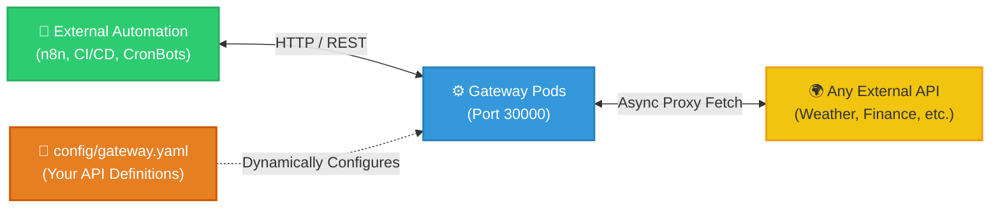

# Universal API Gateway 🚀

<p align="center">
  
</p>

<p align="center">
  <a href="https://github.com/PoisonOakey/universal-api-gateway/actions/workflows/ci.yml"></a>
  <a href="LICENSE"></a>
  
</p>

> Third-party APIs behind one container, so the systems calling them never hardcode an upstream URL, a retry, or a rate limit.

---

## 🎯 What it does

A reverse proxy that turns a YAML file into API routes. List an API in `config/gateway.yaml` and the gateway serves a matching endpoint for it. Adding or removing one is an edit and a restart — no Python.



---

## 📸 The Result

The same image, running in two places.

### 🐳 Locally, with Docker Compose


Every route under **Weather** and **Dummy** exists because `config/gateway.yaml` declares it. No Python was written for any of them.


Health check passes, an unauthenticated call is rejected with `401`, and a valid token returns live data from Open-Meteo and dummyjson.com.

---

### ☁️ On Azure Kubernetes Service


Two nodes, two pods, a `LoadBalancer` with a public IP — the same calls, this time from the internet.


Created with `terraform apply`, destroyed with `terraform destroy` in the same session. **The cluster in this screenshot no longer exists.**

---

## 🛠️ Key Engineering Decisions

| Feature | Description |
|---|---|
| **Asynchronous I/O** | While one request waits on a slow provider, the same worker keeps serving everyone else. |
| **Authentication** | Set `API_AUTH_TOKEN` and every proxy route demands it. Health checks stay open, because Kubernetes has no way to send a token. |
| **Rate Limiting** | 100 requests a minute per caller, then a `429`. Each pod counts on its own, so three pods allow 300. |
| **Idempotent Retries** | When an upstream API times out or returns a `502`/`503`/`504`, reads are tried again — three attempts, waiting longer between each. Writes are never retried, so nothing is submitted twice. |
| **Prometheus Metrics** | `/metrics` counts and times every request by method, path and status. Rejections are counted too, not just the calls that worked. |
| **Graceful Shutdown** | When the pod stops, the gateway closes its upstream connections instead of leaving them hanging. |
| **Structured Logging** | One line per request — an ID, the method, path, status and how long it took. |
| **Health Probes** | `/healthz` says the process is alive. `/readyz` says it can take traffic. Kubernetes restarts or reroutes based on the answers. |
| **Container Hardening** | Runs as an ordinary user, not root, and cannot write to its own filesystem. |

Implementation notes are in [`docs/CHANGELOG.md`](docs/CHANGELOG.md).

---

## 📂 Repository Structure

```text
📦 universal-api-gateway/
│
├── 📁 config/
│   └── 📄 gateway.yaml       # 👈 99% of your edits happen here
│
├── 📁 k8s/                   # Kubernetes manifests
│
├── 📁 src/
│   └── 🐍 main.py            # Core Python proxy engine
│
├── 📁 tests/
│   └── 🧪 test_api.py        # Pytest smoke suite (auth, probes, rate limit)
│
├── 📁 docs/                  # Architecture & troubleshooting guides
├── ⚙️ start.bat              # One-click local startup
├── 📄 .env.example           # Environment variable template — copy to .env
├── 📄 requirements.txt       # Runtime dependencies (pinned)
├── 📄 requirements-dev.txt   # Test-only dependencies (not shipped in the image)
├── 🐳 Dockerfile
└── 🐳 docker-compose.yml
```

---

## 📌 Usage: "Fill in the Blanks"

> [!IMPORTANT]  
> **Do NOT edit `src/main.py`** unless you are extending the engine itself.

**Example `config/gateway.yaml`:**
```yaml
gateways:
  - name: "weather"
    base_url: "https://api.open-meteo.com/v1"
    routes:
      - path: "/current"
        method: "GET"
        target_path: "/forecast?latitude=52.52&longitude=13.41&current=temperature_2m"
```
Registers a proxy route at `http://localhost:30000/api/weather/current`. It's open by default — set `API_AUTH_TOKEN` below if it needs to require a Bearer token.

### Environment Variables

| Variable | Default | Effect |
|---|---|---|
| `CONFIG_PATH` | `config/gateway.yaml` | Path to the gateway config file. |
| `ALLOWED_ORIGINS` | `http://localhost,http://localhost:30000` | Comma-separated CORS allow-list. |
| `API_AUTH_TOKEN` | *(unset)* | Bearer token required on proxy routes. Unset = auth disabled (startup warning logged). |

Copy `.env.example` to `.env` and edit it — `docker-compose.yml` loads it automatically.

---

## 🚀 Quickstart

### Run the published image

Every push to `main` that clears all six gates lands here, tagged `latest` and by commit SHA. Nothing to build:

```bash
docker run --rm -p 30000:8000 -v "$PWD/config:/app/config:ro" \
  ghcr.io/poisonoakey/universal-api-gateway:latest
```

Then `http://localhost:30000/docs`, same as the local build.

### Local Development (Easy Mode)
1. Ensure **Docker Desktop** is running.
2. Edit `config/gateway.yaml` with your target APIs.
3. Optional: copy `.env.example` to `.env` and set `API_AUTH_TOKEN` if you want proxy routes protected.
4. Run `start.bat`.
5. Visit `http://localhost:30000/docs` for the generated Swagger UI, or `http://localhost:30000/metrics` for Prometheus metrics.

### Kubernetes
To run it on a cluster, use the raw manifests in `k8s/`.

```bash
docker build -t universal-api-gateway:latest .
kubectl apply -k .
```

#### 🛡️ Dry Run
Verify the manifests compile without deploying:
```bash
kubectl kustomize .
```
*(Prints the rendered YAML to your terminal).*

---

## 📈 Metrics

What the gateway changes for the systems calling those APIs.

| Metric | Calling APIs directly | Through the gateway |
| :--- | :--- | :--- |
| **Adding an upstream** | Code change in every caller, then redeploy each one | One entry in `config/gateway.yaml`, one restart |
| **Retry policy** | Reimplemented per caller, or missing | 3 attempts with exponential backoff, `GET`/`HEAD` only, never on writes |
| **Rate limiting** | Per caller if at all, upstream quota unprotected | 100 req/min per route, enforced before the request leaves |
| **Upstream credentials** | Copied into every caller that needs them | Held in one container, callers never see them |
| **Request visibility** | Whatever each caller happens to log | One structured line per request, plus `/metrics` by method, path and status |

---

## 📚 Documentation
- [Architecture Overview](docs/ARCHITECTURE.md) — The three layers, how a commit reaches a cluster, and the request lifecycle step by step.
- [K8s Infrastructure](k8s/README.md) — How K8s is being utilized here.
- [Engine Guide](src/README.md) — Details on the `main.py` Python proxy.
- [Troubleshooting](docs/TROUBLESHOOTING.md) — Infrastructure debugging, port collision fixes, and CI/CD gate failures.
- [Changelog](docs/CHANGELOG.md) — Release notes.
- [Future Roadmap](docs/FUTURE_ROADMAP.md) — Planned features, and what is deliberately not built yet.

---

## ⚙️ CI/CD Pipeline

Six gates in parallel on every push and PR to `main`. All six must pass before the image reaches GHCR.

| Gate | What it checks |
| :--- | :--- |
| **Lint** | `ruff check` over `src/` and `tests/` |
| **Tests** | `pytest` with coverage, floored at 75% |
| **Dependency audit** | `pip-audit` over both requirements files, failing on a known CVE |
| **Validate infrastructure** | `terraform validate` for AKS, `kustomize build` for base and cloud, then `kubeconform` against real Kubernetes schemas |
| **Secret scan** | `gitleaks` across the full history, not just the tip |
| **Build & scan image** | Trivy, blocking on any fixable HIGH or CRITICAL |

Dependabot proposes updates weekly for pip, Actions, and the base image.

Worth running before you push:

```bash
ruff check src tests
pytest --cov=src --cov-report=term-missing
pip-audit -r requirements.txt -r requirements-dev.txt
```

CI never creates a cluster or deploys to one. A green check means the image is publishable — not that anything is running.

When a gate fails, [Troubleshooting → CI/CD](docs/TROUBLESHOOTING.md#cicd-github-actions) has the root cause for each.
