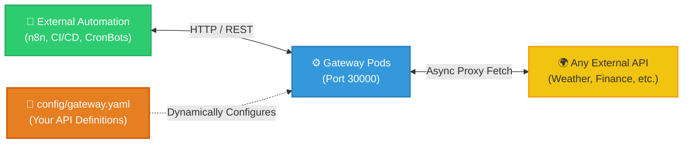

# Universal API Gateway 🚀

> A YAML-configured reverse proxy for third-party APIs, packaged as a Docker container with a Kubernetes deployment path. "Self-healing" here means what it means for any stateless K8s Deployment: crashed pods get restarted by Kubernetes, not by application logic.

---

## 🎯 What it does

A reverse proxy that turns a YAML file into a set of API routes. Define an upstream API and its routes in `config/gateway.yaml`; the FastAPI app reads that file on startup and dynamically registers a matching proxy route for each entry — no Python code changes needed to add or remove an upstream.



---

## 🛠️ Core SRE Features

- **Authentication**: Opt-in Bearer token check on proxy routes only. Unset `API_AUTH_TOKEN` = auth disabled (logs a startup warning). Set it, and requests must send `Authorization: Bearer <token>`. Health/metrics endpoints are never protected, so probes can't be locked out by a misconfigured token.
- **Rate Limiting**: 100 req/min per route, per client IP, via `slowapi`. Returns `429 Too Many Requests` with `Retry-After`. **Caveat:** the counter is in-memory and per-process — with the K8s Deployment's 2 replicas, the effective ceiling is up to ~200/min split across pods, not a hard global 100/min.
- **Idempotent Retries**: `GET`/`HEAD` requests retry up to 3 times (capped exponential backoff) on connection errors, timeouts, or `502`/`503`/`504` upstream responses. `POST`/`PUT`/`PATCH` are never retried, to avoid duplicating a write that may have already succeeded upstream.
- **Prometheus Metrics**: `/metrics` endpoint exposing request count and latency histograms, labeled by the route *template* (e.g. `/api/dummy/products/{id}`) rather than the literal request path, so per-ID traffic doesn't blow up label cardinality.
- **Graceful Shutdown**: The shared `httpx` client is opened and closed via a FastAPI `lifespan` handler, so in-flight connections are released cleanly on `SIGTERM`.
- **Structured Logging**: Every request logs one line — `request_id`, `method`, `path`, `status`, `duration_ms` — to stdout.
- **Health Probes**: `/healthz` (liveness, always 200 if the process is up) and `/readyz` (readiness, 503 if config failed to load or zero routes registered).
- **Container Hardening**: Non-root user (`UID 1000`), read-only root filesystem, `allowPrivilegeEscalation: false`, all Linux capabilities dropped (K8s `securityContext`).

See [`docs/CHANGELOG.md`](docs/CHANGELOG.md) for when/why each of these was added.

---

## 📂 Repository Structure

```text
📦 universal-api-gateway/
│
├── 📁 config/
│   └── 📄 gateway.yaml       # 👈 99% of your edits happen here
│
├── 📁 enterprise-k8s/        # Kubernetes manifests for production
│
├── 📁 src/
│   └── 🐍 main.py            # Core Python proxy engine
│
├── 📁 tests/
│   └── 🧪 test_api.py        # Pytest smoke suite (auth, probes, rate limit)
│
├── 📁 docs/                  # Architecture & troubleshooting guides
├── ⚙️ start.bat              # One-click local startup
├── 📄 .env.example           # Environment variable template — copy to .env
├── 📄 requirements.txt       # Runtime dependencies (pinned)
├── 📄 requirements-dev.txt   # Test-only dependencies (not shipped in the image)
├── 🐳 Dockerfile
└── 🐳 docker-compose.yml
```

### Environment Variables

| Variable | Default | Effect |
|---|---|---|
| `CONFIG_PATH` | `config/gateway.yaml` | Path to the gateway config file. |
| `ALLOWED_ORIGINS` | `http://localhost,http://localhost:30000` | Comma-separated CORS allow-list. |
| `API_AUTH_TOKEN` | *(unset)* | Bearer token required on proxy routes. Unset = auth disabled (startup warning logged). |

Copy `.env.example` to `.env` and edit it — `docker-compose.yml` loads it automatically.

---

## 📌 Usage: "Fill in the Blanks"

> [!IMPORTANT]  
> **Do NOT edit `src/main.py`** unless extending the core engine. Just define your APIs in `config/gateway.yaml` and let the engine handle the rest.

**Example `config/gateway.yaml`:**
```yaml
gateways:
  - name: "weather"
    base_url: "https://api.open-meteo.com/v1"
    routes:
      - path: "/current"
        method: "GET"
        target_path: "/forecast?latitude=52.52&longitude=13.41&current=temperature_2m"
```
Registers a proxy route at `http://localhost:30000/api/weather/current`. It's open by default — set `API_AUTH_TOKEN` (see [Environment Variables](#environment-variables)) if it needs to require a Bearer token.

---

## 🚀 Quickstart

### Local Development (Easy Mode)
1. Ensure **Docker Desktop** is running.
2. Edit `config/gateway.yaml` with your target APIs.
3. Optional: copy `.env.example` to `.env` and set `API_AUTH_TOKEN` if you want proxy routes protected.
4. Run `start.bat`.
5. Visit `http://localhost:30000/docs` for the generated Swagger UI, or `http://localhost:30000/metrics` for Prometheus metrics.

### Production (Kubernetes)
For production clusters, use the raw manifests in `enterprise-k8s/`.

```bash
docker build -t universal-api-gateway:latest .
kubectl apply -k .
```

#### 🛡️ Verifying K8s Manifests (Dry Run)
Verify manifests compile correctly without deploying:
```bash
kubectl kustomize .
```
*(Prints the rendered YAML to your terminal).*

---

## 📚 Documentation
- [Architecture Overview](docs/ARCHITECTURE.md) — How the 3-Tier engine is mapped.
- [K8s Infrastructure](enterprise-k8s/README.md) — How K8s is being utilized here.
- [Engine Guide](src/README.md) — Details on the `main.py` Python proxy.
- [Troubleshooting](docs/TROUBLESHOOTING.md) — Infrastructure debugging and port collision fixes.
- [Changelog](docs/CHANGELOG.md) — Release notes.

---

## ⚙️ CI/CD Pipeline

GitHub Actions runs on every push/PR to `main`: install dependencies → run the `pytest` smoke suite (`tests/test_api.py`) → build the Docker image (dry run, not pushed). A failing test blocks the build step. Run the same suite locally with:
```bash
pip install -r requirements.txt -r requirements-dev.txt
pytest
```
