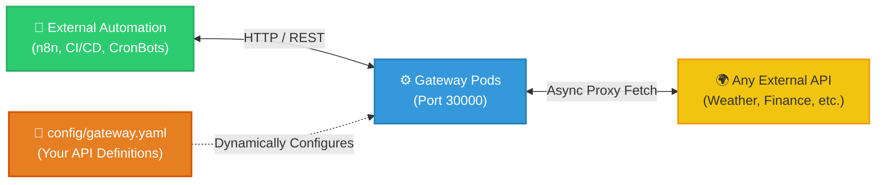

# Universal API Gateway 🚀

> A containerized, self-healing, plug-and-play API gateway. Instantly proxy and orchestrate external services via a simple YAML configuration.

---

## 🎯 What it does

A **vendor-less, plug-and-play middleware brick**. It abstracts third-party APIs (Weather, Finance, AI, etc.) behind a robust FastAPI layer.

No Python coding required. Define your APIs in `gateway.yaml` and the system instantly generates high-speed proxy routes.



---

## 📂 Repository Structure

```text
📦 universal-api-gateway/
│
├── 📁 config/
│   └── 📄 gateway.yaml       # 👈 99% of your edits happen here
│
├── 📁 enterprise-k8s/        # Kubernetes manifests for production
│
├── 📁 src/
│   └── 🐍 main.py            # Core Python proxy engine
│
├── 📁 docs/                  # Architecture & troubleshooting guides
├── ⚙️ start.bat              # One-click local startup
├── 🐳 Dockerfile
└── 🐳 docker-compose.yml
```

---

## 📌 Usage: "Fill in the Blanks"

> [!IMPORTANT]  
> **Do NOT edit `src/main.py`** unless extending the core engine. Just define your APIs in `config/gateway.yaml` and let the engine handle the rest.

**Example `config/gateway.yaml`:**
```yaml
gateways:
  - name: "weather"
    base_url: "https://api.open-meteo.com/v1"
    routes:
      - path: "/current"
        method: "GET"
        target_path: "/forecast?latitude=52.52&longitude=13.41&current=temperature_2m"
```
Automatically generates a secure proxy route at: `http://localhost:30000/api/weather/current`

---

## 🚀 Quickstart

### Local Development (Easy Mode)
1. Ensure **Docker Desktop** is running.
2. Edit `config/gateway.yaml` with your target APIs.
3. Run `start.bat`.
4. Visit `http://localhost:30000/docs` for the generated Swagger UI.

### Production (Kubernetes)
For production clusters, use the raw manifests in `enterprise-k8s/`.

```bash
docker build -t universal-api-gateway:latest .
kubectl apply -k .
```

#### 🛡️ Verifying K8s Manifests (Dry Run)
Verify manifests compile correctly without deploying:
```bash
kubectl kustomize .
```
*(Prints the rendered YAML to your terminal).*

---

## 📚 Documentation
- [Architecture Overview](docs/ARCHITECTURE.md) — How the 3-Tier engine is mapped.
- [K8s Infrastructure](enterprise-k8s/README.md) — How K8s is being utilized here.
- [Engine Guide](src/README.md) — Details on the `main.py` Python proxy.
- [Troubleshooting](docs/TROUBLESHOOTING.md) — Infrastructure debugging and port collision fixes.
- [Changelog](docs/CHANGELOG.md) — Release notes.
