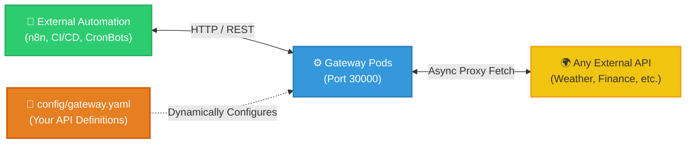

# Universal API Gateway 🚀

<p align="center">
  
</p>

> A YAML-configured reverse proxy for third-party APIs, packaged as a plug-and-play container that deploys with Docker or Kubernetes so the systems calling it never hardcode upstream URLs, retries, or rate limits.

---

## 🎯 What it does

A reverse proxy that turns a YAML file into a set of API routes. List the APIs you want to reach in `config/gateway.yaml`, and on startup the gateway creates a matching endpoint on itself for each one. Adding or removing an API means editing that file and restarting — no Python involved.



---

## 📸 The Result

Both captures below come from `docker compose up` on a local machine.


Every route under **Weather** and **Dummy** exists because `config/gateway.yaml` declares it. No Python was written for any of them — the file is read at startup and each entry becomes an endpoint, which is the whole point of the gateway. `/healthz`, `/readyz`, and `/metrics` are built in and unaffected by the config.


The gateway answers `/healthz`, rejects an unauthenticated proxy call with `401`, then serves live data from Open-Meteo and dummyjson.com when a valid bearer token is supplied. `gateway_requests_total` counts all of it, labelled by method, path, and status — including the rejection. A metric that only counts successes tells you nothing on the day something breaks.

> **Scope of these captures.** They show the application running in a container. They are not evidence about Kubernetes or any cloud provider: the manifests in `k8s/` and the Terraform in `terraform/` have not been applied to a running cluster. See [Not Built Yet](docs/FUTURE_ROADMAP.md).

---

## 🛠️ Key Engineering Decisions

| Feature | Description |
|---|---|
| **Authentication** | Opt-in Bearer token protection for proxy routes (`API_AUTH_TOKEN`). Health probes remain safely unauthenticated. |
| **Rate Limiting** | 100 req/min per route. Returns standard `429 Too Many Requests` (in-memory, scaled per pod). |
| **Idempotent Retries** | Automatic exponential backoff (up to 3x) for `GET`/`HEAD` requests on `502`/`503`/`504` upstream failures. |
| **Prometheus Metrics** | High-cardinality safe `/metrics` endpoint tracking request latency and volume natively. |
| **Graceful Shutdown** | The shared HTTP client is closed on FastAPI `lifespan` exit, releasing in-flight upstream connections. |
| **Structured Logging** | Built-in key/value observability (`request_id`, `method`, `path`, `status`, `duration_ms`). |
| **Health Probes** | Explicit `/healthz` (liveness) and `/readyz` (readiness) endpoints. |
| **Container Hardening** | Runs as non-root (`UID 1000`) on a read-only filesystem with dropped capabilities. |

See [`docs/CHANGELOG.md`](docs/CHANGELOG.md) for detailed implementation notes.

---

## 📂 Repository Structure

```text
📦 universal-api-gateway/
│
├── 📁 config/
│   └── 📄 gateway.yaml       # 👈 99% of your edits happen here
│
├── 📁 k8s/                   # Kubernetes manifests
│
├── 📁 src/
│   └── 🐍 main.py            # Core Python proxy engine
│
├── 📁 tests/
│   └── 🧪 test_api.py        # Pytest smoke suite (auth, probes, rate limit)
│
├── 📁 docs/                  # Architecture & troubleshooting guides
├── ⚙️ start.bat              # One-click local startup
├── 📄 .env.example           # Environment variable template — copy to .env
├── 📄 requirements.txt       # Runtime dependencies (pinned)
├── 📄 requirements-dev.txt   # Test-only dependencies (not shipped in the image)
├── 🐳 Dockerfile
└── 🐳 docker-compose.yml
```

### Environment Variables

| Variable | Default | Effect |
|---|---|---|
| `CONFIG_PATH` | `config/gateway.yaml` | Path to the gateway config file. |
| `ALLOWED_ORIGINS` | `http://localhost,http://localhost:30000` | Comma-separated CORS allow-list. |
| `API_AUTH_TOKEN` | *(unset)* | Bearer token required on proxy routes. Unset = auth disabled (startup warning logged). |

Copy `.env.example` to `.env` and edit it — `docker-compose.yml` loads it automatically.

---

## 📌 Usage: "Fill in the Blanks"

> [!IMPORTANT]  
> **Do NOT edit `src/main.py`** unless extending the core engine. Just define your APIs in `config/gateway.yaml` and let the engine handle the rest.

**Example `config/gateway.yaml`:**
```yaml
gateways:
  - name: "weather"
    base_url: "https://api.open-meteo.com/v1"
    routes:
      - path: "/current"
        method: "GET"
        target_path: "/forecast?latitude=52.52&longitude=13.41&current=temperature_2m"
```
Registers a proxy route at `http://localhost:30000/api/weather/current`. It's open by default — set `API_AUTH_TOKEN` (see [Environment Variables](#environment-variables)) if it needs to require a Bearer token.

---

## 🚀 Quickstart

### Local Development (Easy Mode)
1. Ensure **Docker Desktop** is running.
2. Edit `config/gateway.yaml` with your target APIs.
3. Optional: copy `.env.example` to `.env` and set `API_AUTH_TOKEN` if you want proxy routes protected.
4. Run `start.bat`.
5. Visit `http://localhost:30000/docs` for the generated Swagger UI, or `http://localhost:30000/metrics` for Prometheus metrics.

### Kubernetes
To run it on a cluster, use the raw manifests in `k8s/`.

```bash
docker build -t universal-api-gateway:latest .
kubectl apply -k .
```

#### 🛡️ Verifying K8s Manifests (Dry Run)
Verify manifests compile correctly without deploying:
```bash
kubectl kustomize .
```
*(Prints the rendered YAML to your terminal).*

---

## 📚 Documentation
- [Architecture Overview](docs/ARCHITECTURE.md) — How the 3-Tier engine is mapped.
- [K8s Infrastructure](k8s/README.md) — How K8s is being utilized here.
- [Engine Guide](src/README.md) — Details on the `main.py` Python proxy.
- [Troubleshooting](docs/TROUBLESHOOTING.md) — Infrastructure debugging and port collision fixes.
- [Changelog](docs/CHANGELOG.md) — Release notes.
- [Future Roadmap](docs/FUTURE_ROADMAP.md) — Planned features, and what is deliberately not built yet.

---

## ⚙️ CI/CD Pipeline

GitHub Actions runs on every push/PR to `main`: install dependencies → run the `pytest` smoke suite (`tests/test_api.py`) → build the Docker image (dry run, not pushed). A failing test blocks the build step. Run the same suite locally with:
```bash
pip install -r requirements.txt -r requirements-dev.txt
pytest
```
