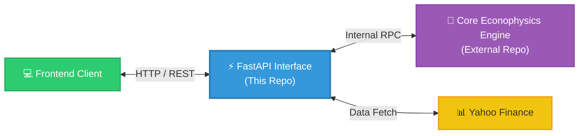

# Econophysics API Interface

> A lightweight FastAPI middleware and documentation hub for our Econophysics trading system.

---

## 🎯 Project Scope
To be completely clear: **This repository is strictly an API interface.** 

The heavy lifting—the actual thermodynamic market calculations, Shannon entropy processing, and complex economic modeling—lives in a separate, dedicated engine repository. 

This project serves two specific purposes:
1. **API Gateway:** A FastAPI layer that safely exposes the underlying econophysics engine to our frontend applications.
2. **Documentation Hub:** The single source of truth for our API contracts, payloads, and endpoint structures.

---

## 🚀 What This API Exposes
* **Econophysics Alerts:** Endpoints for the frontend to subscribe to structural market entropy drops.
* **Transfer Entropy Mapping:** Endpoints to fetch causal information flows between SEA assets.
* **Market Data:** Standardized RESTful routing for Yahoo Finance data.

---

## ⚙️ Architecture



---

## 📁 Repository Structure
```text
.
├── src/                    # Source code
│   ├── api/                # API routing logic
│   └── main.py             # Application entry point
├── docs/                   # Documentation
│   ├── api_documentation.md
│   └── walkthrough.md
├── tests/                  # API endpoint unit tests
├── Dockerfile              # Container definition for the API
├── requirements.txt        # Python dependencies
└── README.md               # This file
```

---

## 📚 API Documentation
For full technical details, HTTP methods, and JSON payload schemas, please see the [API Documentation](docs/api_documentation.md).
