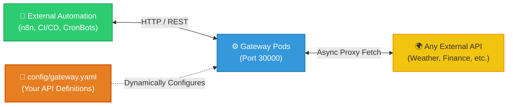

# Universal API Gateway

> A containerized, self-healing, plug-and-play API gateway. Instantly proxy and orchestrate any external service via simple YAML configuration.

---

## 🎯 Architecture & Purpose

This project is a **vendor-less, plug-and-play middleware brick**. It abstracts any third-party APIs (Weather, Finance, AI, etc.) behind a robust, containerized FastAPI layer. 

Instead of hardcoding logic in Python, this entire system is driven by a simple `gateway.yaml` file. An amateur user can simply "fill in the blanks" to connect to any backend API they want, and the system instantly generates the necessary high-speed proxy routes.



---

## 📌 How to Use: "Fill in the Blanks"

> [!IMPORTANT]
> **Do NOT edit `src/main.py`** unless you are an advanced developer extending the core proxy engine (e.g., adding rate limiting or global auth middleware). 
> For 99% of use cases, you simply open `config/gateway.yaml` and define the APIs you want to proxy. The Python engine will handle the rest automatically.

```yaml
gateways:
  - name: "weather"
    base_url: "https://api.open-meteo.com/v1"
    routes:
      - path: "/weather/current"
        method: "GET"
        target_path: "/forecast?latitude=52.52&longitude=13.41&current=temperature_2m"
```
The gateway will automatically spawn a new route at `http://localhost:30000/api/weather/weather/current` that safely proxies your request.

---

## 🚀 Quickstart Deployment

We offer two deployment paths depending on your needs.

### Path A: Normal User (Easy Mode)
If you just want to run the API locally without dealing with clusters or complex terminals, use this method.

1. Ensure **Docker Desktop** is running.
2. Edit `config/gateway.yaml` to point to the APIs you want.
3. Double-click the `start.bat` file in the root folder.
4. Open `http://localhost:30000/docs` to see your dynamically generated Swagger documentation.

### Path B: Enterprise (Kubernetes)
If you are deploying to a production cluster, use the raw Infrastructure-as-Code manifests tucked away in the `enterprise-k8s/` folder.

```bash
docker build -t universal-api-gateway:latest .
kubectl apply -k .
```

#### 🛡️ Verifying K8s Manifests (Dry Run)
If you are modifying the Kubernetes files and want to verify they compile correctly *without* actually deploying them to a cluster, you can run a Kustomize dry-run:
```bash
kubectl kustomize .
```
This will print the fully rendered YAML to your terminal, proving your manifests are structurally perfect.

---

## 📚 Documentation
- [Architecture Overview](docs/ARCHITECTURE.md) — How the 3-Tier engine is mapped.
- [K8s Infrastructure](enterprise-k8s/README.md) — How K8s is being utilized here.
- [Engine Guide](src/README.md) — Details on the `main.py` Python proxy.
- [Troubleshooting](docs/TROUBLESHOOTING.md) — Infrastructure debugging and port collision fixes.
- [Changelog](docs/CHANGELOG.md) — Release notes.
