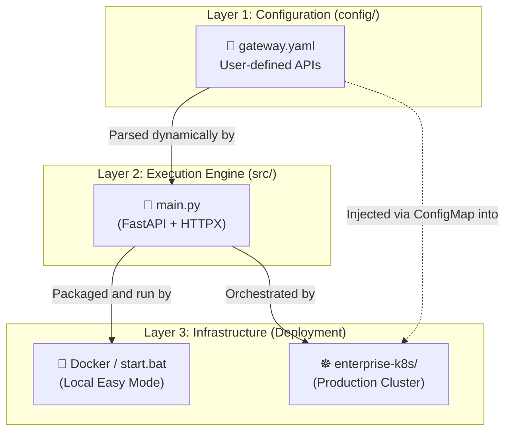

# Architecture Overview

This document provides a high-level overview of the entire Gateway ecosystem. If you are trying to understand how all the folders and systems communicate, this is the map.

---

## 🏗️ The 3-Tier Architecture

The repository is intentionally split into three distinct layers to ensure a clean Separation of Concerns (SoC).

### Layer 1: Configuration (`config/`)
This is the **Control Plane**. It contains the `gateway.yaml` file. This layer exists so that normal users never have to touch code. They define what APIs they want to use here, and the rest of the system obeys.

### Layer 2: Execution Engine (`src/`)
This is the **Data Plane**. It contains `main.py` — reads the config layer and generates the proxy routes from it. Backend work here means: connection lifecycle (the shared `httpx` client), timeouts/retries, request logging and metrics, auth/CORS, and — not yet built — response caching.

### Layer 3: Infrastructure (`enterprise-k8s/` & Docker)
This is the **Hosting Plane**. It determines *where* the engine runs. 
- The `docker-compose.yml` (and `start.bat`) provide an easy local hosting environment.
- The `enterprise-k8s/` folder provides the declarative YAML needed to deploy the engine to a production Kubernetes cluster (with strict non-root and read-only filesystem security constraints).

---

## 🔄 The Request Lifecycle

When a piece of external automation (like n8n or a cron job) makes a request to the Gateway, this is the exact flow:

1. **Ingress:** The request hits the Kubernetes `NodePort` (or Docker port) at `:30000`.
2. **Routing & CORS:** FastAPI handles CORS preflight checks and matches the URL path against the routes it dynamically generated during startup.
3. **Authentication:** For proxy routes, FastAPI verifies the `Authorization: Bearer <token>` header against the `API_AUTH_TOKEN` environment variable. If missing or invalid, it rejects the request (401).
4. **Rate Limiting:** The `slowapi` decorator checks the client IP against the per-route limit (`100/min`). If exceeded, it rejects the request with a `429 Too Many Requests`.
5. **Proxy & Retry:** The `httpx` async client intercepts the request and forwards the payload to the external provider. If the upstream fails with a `502`, `503`, or `504` on a safe method (`GET`/`HEAD`), `tenacity` retries the request using exponential backoff.
6. **Metrics:** Latency and status codes are recorded into Prometheus metrics registries for real-time observability.
7. **Egress:** The upstream response is piped directly back to the automation tool.
