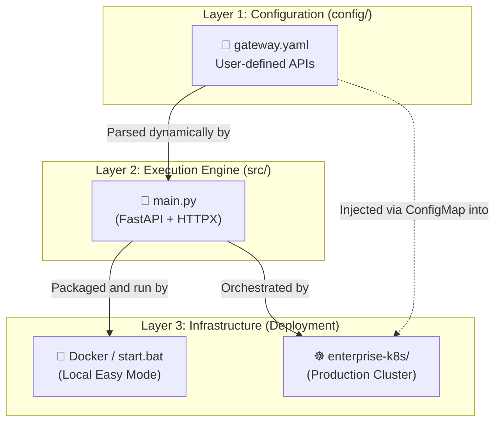

# Architecture Overview

This document provides a high-level overview of the entire Gateway ecosystem. If you are trying to understand how all the folders and systems communicate, this is the map.

---

## 🏗️ The 3-Tier Architecture

The repository is intentionally split into three distinct layers to ensure a clean Separation of Concerns (SoC).

### Layer 1: Configuration (`config/`)
This is the **Control Plane**. It contains the `gateway.yaml` file. This layer exists so that normal users never have to touch code. They define what APIs they want to use here, and the rest of the system obeys.

### Layer 2: Execution Engine (`src/`)
This is the **Data Plane**. It contains `main.py`, the dynamic proxy engine written in Python (FastAPI). It blindly reads the configuration layer and executes the HTTP proxying at ultra-high speeds. Backend developers work in this layer to optimize performance (like adding cache).

### Layer 3: Infrastructure (`enterprise-k8s/` & Docker)
This is the **Hosting Plane**. It determines *where* the engine runs. 
- The `docker-compose.yml` (and `start.bat`) provide an easy local hosting environment.
- The `enterprise-k8s/` folder provides the declarative YAML needed to deploy the engine to a production Kubernetes cluster.

---

## 🔄 The Request Lifecycle

When a piece of external automation (like n8n or a cron job) makes a request to the Gateway, this is the exact flow:

1. **Ingress:** The request hits the Kubernetes `NodePort` (or Docker port) at `:30000`.
2. **Routing:** FastAPI matches the URL path against the routes it dynamically generated during startup.
3. **Proxy:** The `httpx` async client intercepts the request, injects any necessary API keys, and forwards the payload to the external provider (e.g., Open-Meteo, Yahoo Finance).
4. **Egress:** The response is piped directly back to the automation tool.
