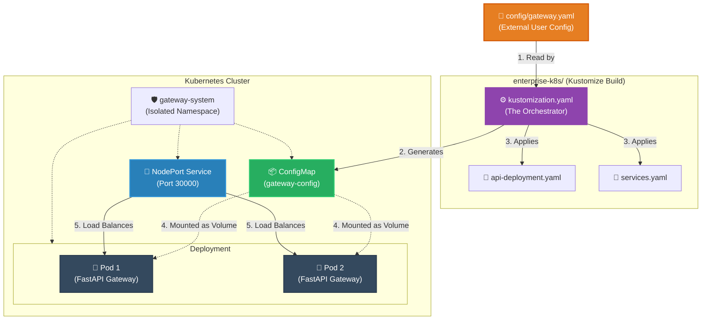

# Enterprise Kubernetes Architecture

If you are reading this, you have likely bypassed the local `docker-compose` setup and are preparing to deploy this Gateway to a true Kubernetes cluster. 

This directory contains the **Infrastructure as Code (IaC)** required to spin up a highly available, self-healing, configuration-driven proxy.

---

## 🏗️ The Architecture (Show, Don't Tell)

How does a single YAML file on your laptop turn into a clustered production API? Here is exactly what happens when you run `kubectl apply -k .`



---

## 📂 File Breakdown & Best Practices

### 1. `kustomization.yaml` (The Magic)
**Why we use it:** Best practice dictates that users should have a "Single Source of Truth." We do not want users copying and pasting configuration into a hardcoded Kubernetes ConfigMap. 
**What it does:** Kustomize dynamically reads the external `config/gateway.yaml` file and securely converts it into a native Kubernetes ConfigMap on the fly. 

### 2. `api-deployment.yaml`
**Why we use it:** Bare containers crash. Deployments don't.
**What it does:** 
- Requests exactly 2 replicas (Pods) to ensure high availability.
- Mounts the Kustomize-generated ConfigMap directly into the Pod's filesystem at `/app/config`.
- Defines strict `liveness` and `readiness` probes. If a FastAPI instance deadlocks, Kubernetes will automatically shoot it in the head and spin up a fresh one.

### 3. `services.yaml`
**Why we use it:** Pod IP addresses change every time they restart. Services provide a static network anchor.
**What it does:** Uses a `NodePort` to explicitly expose the API on port `30000` across all cluster nodes. This makes it incredibly easy for external orchestrators (like n8n) to reliably hit the API without complex Ingress controllers.

### 4. `namespace.yaml`
**Why we use it:** Security and blast-radius control.
**What it does:** Isolates all Gateway resources into `gateway-system`. If you ever need to nuke the API, you simply delete the namespace, and everything is wiped clean instantly without affecting the rest of your cluster.

---

## 🚀 Deployment

To deploy this architecture, run the Kustomize apply command from the root of the repository:

```bash
kubectl apply -k enterprise-k8s/
```

To verify the deployment is healthy:
```bash
kubectl get all -n gateway-system
```
